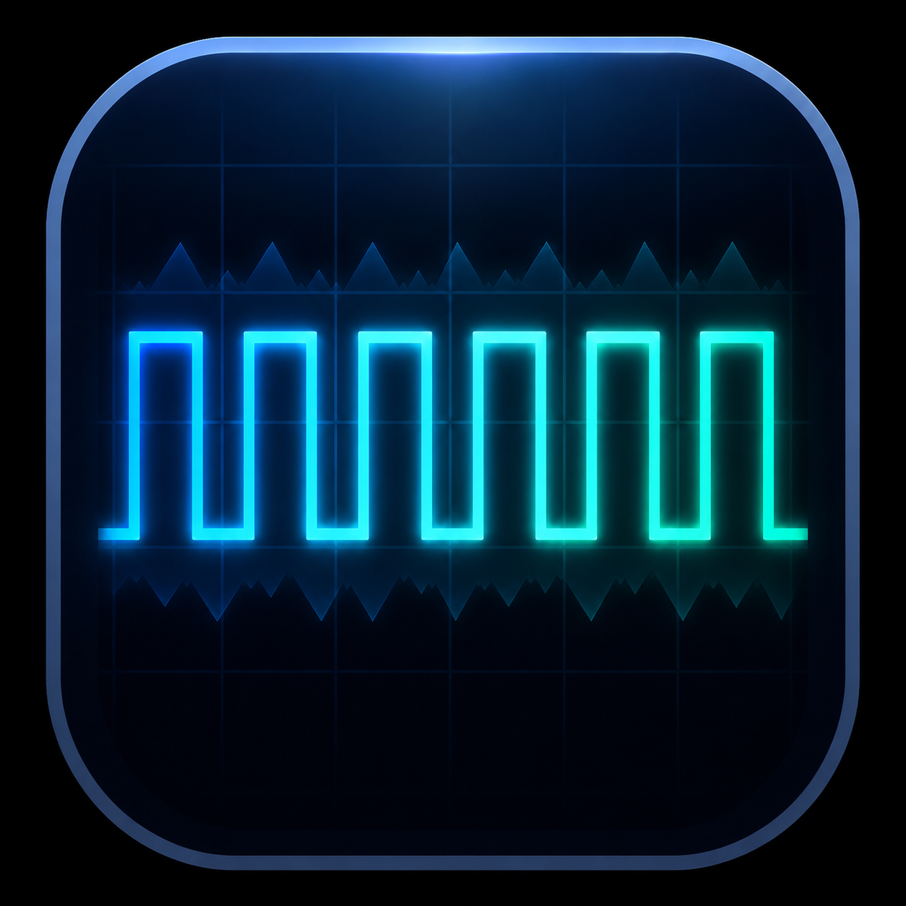

# OSCILLOSCOPE

## 音の波を、光で見る

スマートフォンで音の波形をリアルタイム表示できるWebアプリです。  
周波数変更・波形切替・オシロスコープ表示を搭載しています。

## 主な機能

- リアルタイム波形表示
- 周波数入力
- プリセット周波数
- サイン波
- 三角波
- 矩形波
- ノコギリ波
- PWA対応
- 音声処理の安全終了

## 更新履歴

### v0.1.3（2026-07-01）

- AudioContext安定化
- 音声処理安全終了追加
- バージョン表示追加
- PWA設定改善
- アイコン更新
